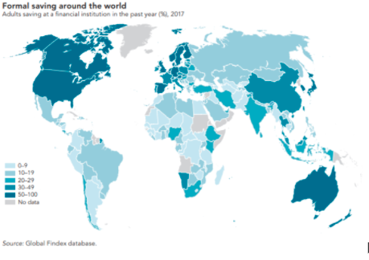

# Reto: Ayuda a Invertir

## Proyecto Kalan

## Available Scripts

### **Solución:**

Un medio de inversión que empodere dirigido a aquellos que aún no ahorran, para que puedan invertir de forma sencilla. Un difusor de cultura financiera, combinado con un juego que proporcione facilidad e interacción.

## Identificación del problema

Launches the test runner in the interactive watch mode.

### **Antecedentes:**

Cuando hablamos de tener una buena salud financiera, un pilar fundamental es el ahorro y su planificación. Sin embargo, cuando hablamos de ahorro, hoy casi el 62% lo hace en una cuenta corriente o en metálico y solo el 8% lo hace a través de la inversión, con la consecuente pérdida de poder adquisitivo a lo largo de los años.

### **Reto:**

El desafío que tenemos por delante es ayudar a los clientes a considerar la inversión como un medio para hacer crecer su ahorros a medio-largo plazo y mejorar así su salud financiera.

### **Contexto:**

La manera en que los adultos ahorran es diversa y los contrastes entre economías desarrolladas y emergentes son evidentes.

En países con economías desarrolladas, 71% de los adultos reporta haber ahorrado alguna cantidad en los últimos doce meses; en mayor parte se suscribe el ahorro en medios formales como bancos o instituciones de inversión. La proporción disminuye a 43% en los países con economías emergentes, donde el ahorro es ejercido mayormente en medios informales como tandas o círculos de préstamos.

La solución puede dirigirse a las personas que ahorran pero no están suscritos en ninguna institución financiera:

### **Conceptos Clave:**

Escuchamos a los que no han recibido una oportunidad acorde a sus necesidades.

    Fortalecer ahorro
    Finanzas personales
    Independencia económica
    Necesidades del cliente:

Nos dimos a la tarea de investigar las necesidades de las personas que aún no se han acercado a una institución financiera para poder proponer una solución que resuelva dichas necesidades, estos son nuestros resultados:

* Las personas buscan liquidez inmediata.

* Rendimientos significativos por su esfuerzo.

* Una solución accesible e inclusiva.

* Incentivos de acuerdo a su desempeño.

## Estructura de la solución

**Ideas generales:**

Permitimos a los usuarios unirse a un vehículo de inversión, un intermediario entre los fondos de inversión tradicionales. El broker del pueblo.

Explicar las desventajas de los fondos de inversión y resaltar las ventajas de la solución propuesta. Los fondos generan desconfianza y no tienen una buena imagen.

**Propuesta:**

La plataforma que nos permitirá resolver estas problemáticas será una página web optimizada para su uso en dispositivos móviles.

Esta plataforma propone un juego que de forma didáctica oriente al usuario a recibir de forma clara y simplificada información financiera de utilidad.

De igual manera la intención es generar salud financiera en los usuarios a través de fomentar buenos hábitos con estrategias de tipo “life hack”

**Ideas practicas:**

Por medio de una serie de niveles, los usuarios escalan beneficios.. Cada nivel corresponde a cierta tasa de rendimiento anual (heredada de los fondos de inversión) que puede incrementarse.

Los usuarios inician en el Nivel 1 con cualquier monto, pueden escalar a lo largo de 5 niveles, mejorando su tasa de rendimiento a cada nivel, recibiendo incentivos por definir, acumulando cultura financiera y acumulando interés compuesto a cada día que pasa.

Por medio de acciones que beneficien su salud financiera como configurar los “life hacks”, subir su ahorro o visitar la sección de información financiera, podrán recibir puntos que le permitan acceder al siguiente nivel.

## Identificación de Riesgos

* ¿Qué nos hace diferentes a un fondo de inversión?
El interés en el cliente por desarrollar su salud financiera así como hacer de los productos de inversión una iniciativa incluyente.

* ¿Somos un "intermediario", una figura buscando sacar ganancia de transacciones financieras?
No, generamos valor con nuestras acciones en sentido de resolver los problemas planteados para poder generar el enlace entre usuarios e institución financiera.

## Notas adicionales

> La teoría de economía conductual permitirá fundamentar respuestas a las preguntas anteriores. Explorar el caso de la aseguradora Lemonade. Transforman los seguros tradicionales (la reputación de las aseguradoras suele ser pésima) ofreciendo montos de suma asegurada a causas de interés humano elegidas por el asegurado.

## Siguientes Pasos:

* César Islas para ficha técnica de fondos de inversión ofrecidos en BBVA.

* Un fondo de inversión sostenible:
[BBVAES](https://www.bbva.mx/personas/productos/inversion/fondos-de-inversion/renta-variable/fondo-de-inversion-sostenible-bbvaesg.html) 

* Reforzar incentivos y recompensas a usuarios

 > Asociar niveles a salud financiera. No garantizar tasas de rendimiento, sugerir umbrales. Fortalecer comunidad por niveles; exponer escenarios de evolución de otros usuarios en mismo nivel.